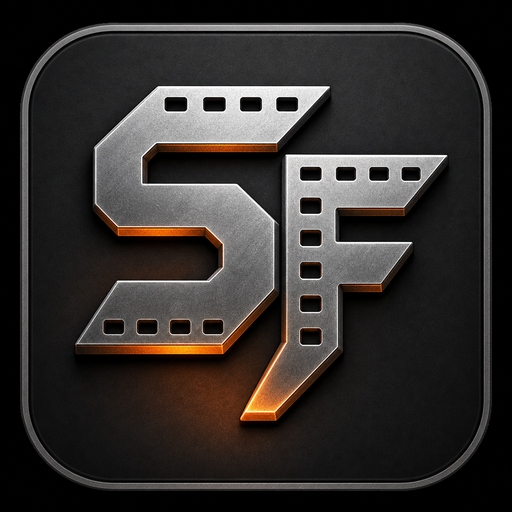

<p align="center">
  
</p>

<h1 align="center">Storyboard Forge</h1>

<p align="center">
  <strong>🎬 AI-Powered Film & Anime Production Tool · Seedance 2.0 · Script-to-Film Batch Pipeline</strong>
</p>

<p align="center">
  <a href="LICENSE"></a>
  <a href="https://github.com/lioneltchami/storyboard-forge/releases"></a>
  <a href="https://github.com/lioneltchami/storyboard-forge/stargazers"></a>
</p>

<p align="center">
  <strong>English</strong> | <a href="README.md">Main README</a>
</p>

<p align="center">
  <a href="docs/WORKFLOW_GUIDE.md"><strong>📖 Workflow Guide</strong></a> •
  <a href="#features">Features</a> •
  <a href="#quick-start">Quick Start</a> •
  <a href="#architecture">Architecture</a> •
  <a href="#license">License</a> •
  <a href="#contributing">Contributing</a>
</p>

---

## Overview

**Storyboard Forge** is a production-grade tool for story-driven video creators. Five interconnected modules cover the full pipeline from script to final video:

> **📝 Script → 🎭 Characters → 🌄 Scenes → 🎬 Director → ⭐ S-Class (Seedance 2.0)**

Each stage automatically feeds the next, so you do not need to manually shuttle data around. The app supports multiple mainstream AI models and is well suited to batch production for short dramas, anime series, trailers, and similar projects.

## Features

### ⭐ S-Class Module - Seedance 2.0 Multimodal Creation
- Multi-shot merged narrative video generation
- @Image / @Video / @Audio multimodal references, including character references, scene images, and auto-collected first frames
- Smart prompt builder with three-layer fusion: action, cinematography, and dialogue lip sync
- First-frame grid stitching with an N x N strategy
- Automatic Seedance 2.0 constraint validation

### 🎬 Script Parsing Engine
- Breaks scripts into scenes, storyboards, and dialogue
- Auto-detects characters, locations, emotions, and camera language
- Supports multi-episode and multi-act script structures

### 🎭 Character Consistency System
- Six-layer identity anchoring for consistent appearance across shots
- Character Bible management
- Character reference image binding

### 🖼️ Scene Generation
- Multi-viewpoint joint image generation
- Automatic conversion from scene descriptions to visual prompts

### 🎞️ Professional Storyboard System
- Cinematic camera parameters such as shot size, angle, and movement
- Auto layout and export
- One-click visual style switching for 2D, 3D, realistic, stop-motion, and more

### 🚀 Batch Production Workflow
- One-click full pipeline: script parsing -> character and scene generation -> storyboard splitting -> batch image generation -> batch video generation
- Multi-task parallel queue with automatic retry on failure
- Designed for short drama and anime series batch production

### 🤖 Multi-Provider AI Orchestration
- Multiple AI image and video generation providers
- API key rotation with load balancing
- Task queue management with automatic retry

## Quick Start

### Requirements

- Node.js >= 18
- npm >= 9

### Install & Run

```bash
# Clone the repository
git clone https://github.com/lioneltchami/storyboard-forge.git
cd storyboard-forge

# Install dependencies
npm install

# Start development mode
npm run dev
```

### Configure API Key

After launching, go to **Settings -> API Configuration** and enter your AI provider API key to start using the tool.

### Workflow Reference

If you are new to the app, start with [docs/WORKFLOW_GUIDE.md](docs/WORKFLOW_GUIDE.md). It covers the baseline script-to-video flow in English and explains where prompt language stays separate from UI language. For script formatting, use [docs/SCRIPT_FORMAT_EXAMPLE.md](docs/SCRIPT_FORMAT_EXAMPLE.md).

### Build

```bash
# Compile + package Windows installer
npm run build

# Compile only (no packaging)
npx electron-vite build
```

## Architecture

| Layer | Technology |
|-------|-----------|
| Desktop Framework | Electron 30 |
| Frontend | React 18 + TypeScript |
| Build Tool | electron-vite (Vite 5) |
| State Management | Zustand 5 |
| UI Components | Radix UI + Tailwind CSS 4 |
| AI Core | `@opencut/ai-core` (prompt compilation, character bible, task polling) |

### Project Structure

```
storyboard-forge/
├── electron/              # Electron main process + preload
│   ├── main.ts            # Main process (storage, file system, protocol handling)
│   └── preload.ts         # Security bridge layer
├── src/
│   ├── components/        # React UI components
│   │   ├── panels/        # Main panels (Script, Character, Scene, Storyboard, Director)
│   │   └── ui/            # Base UI component library
│   ├── stores/            # Zustand global state
│   ├── lib/               # Utilities (AI orchestration, image management, routing)
│   ├── packages/          # Internal packages
│   │   └── ai-core/       # AI core engine
│   └── types/             # TypeScript type definitions
├── build/                 # Build resources (icons)
└── scripts/               # Utility scripts
```

## License

This project uses a dual-licensing model:

### Open Source - AGPL-3.0

This project is open-sourced under the [GNU AGPL-3.0](LICENSE) license. You are free to use, modify, and distribute it, but any modified code must remain open-sourced under the same license.

### Commercial Use

If you need closed-source usage or integration into commercial products, please contact us for a [Commercial License](COMMERCIAL_LICENSE.md).

## Contributing

Contributions are welcome. Please read [CONTRIBUTING.md](CONTRIBUTING.md) for details.

## Contact

- Email: [memecalculate@gmail.com](mailto:memecalculate@gmail.com)
- GitHub: [https://github.com/lioneltchami/storyboard-forge](https://github.com/lioneltchami/storyboard-forge)

---

<p align="center">Made with ❤️ by <a href="https://github.com/lioneltchami">lioneltchami</a></p>
